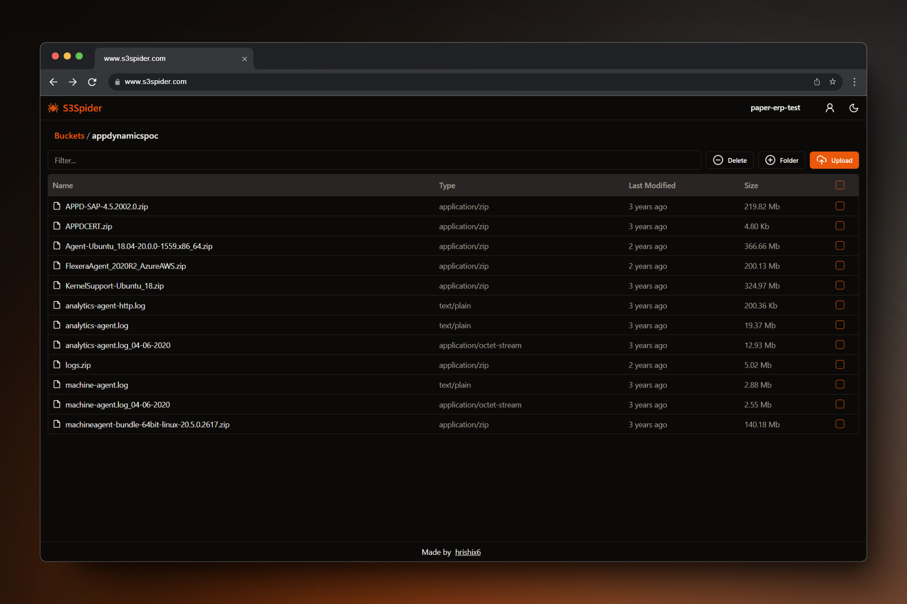

<h1 style="display:flex; align-items:center; gap:5px; justify-content:center;">
    
    S3Spider
</h1>

Self hosted , Simple UI for Amazon S3

## Motivation

Managing files on S3 bucket shouldn't be a cumbersome task, especially for non-technical users. Recognizing the limitations and challenges faced with existing solutions like S3Browser(windows client), I created S3Spider, an open-source web UI designed to interact with S3 without the need for software installations or complex AWS credentials management.

**Pain Points Addressed**

- **No Software Installations**: Traditional solutions often require users to install software on their machines. With S3Spider, you can eliminate the need for installation and provide a hassle-free, browser-based experience for uploading images directly to your S3 bucket.

- **Secure AWS Credential Handling**: Storing AWS credentials locally, can pose security risks. S3Spider alleviates this concern by providing a secure web interface that eliminates the need for saving AWS credentials on the user's machine.

- **Simplified User Onboarding**: Avoid the complexity of creating and managing IAM users for each staff member. S3Spider is designed to be user-friendly, eliminating the need for extensive training or navigating the AWS console.

## Key Features:

- **Web-Based Interface** : Access S3Spider directly from your web browser, eliminating the need for software installations and ensuring a seamless experience for your teams.

- **Secure Authorization**: Grant users access to the S3 bucket without exposing AWS credentials. S3Spider handles authentication securely. Simplified role based access can be assigned to users to specific accounts and what can they do
with files. 

- **Intuitive Design**: Designed with non-technical users in mind, S3Spider offers a user-friendly interface, making file
management a straightforward process.

## Spec

You can read the full specification [TODO].

## Built using

**Frontend**

- [vite](https://vitejs.dev/)
- [react](https://react.dev/)
- [tailwindcss](https://tailwindcss.com/)
- [shadcn ui](https://ui.shadcn.com/)

**Backend**

- [node](https://nodejs.org/en/)
- [express.js](https://expressjs.com/)
- [postgresql](https://www.postgresql.org/)
- [Kysely](https://kysely.dev/)
- [@aws-sdk/client-s3](https://www.npmjs.com/package/@aws-sdk/client-s3)

